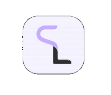
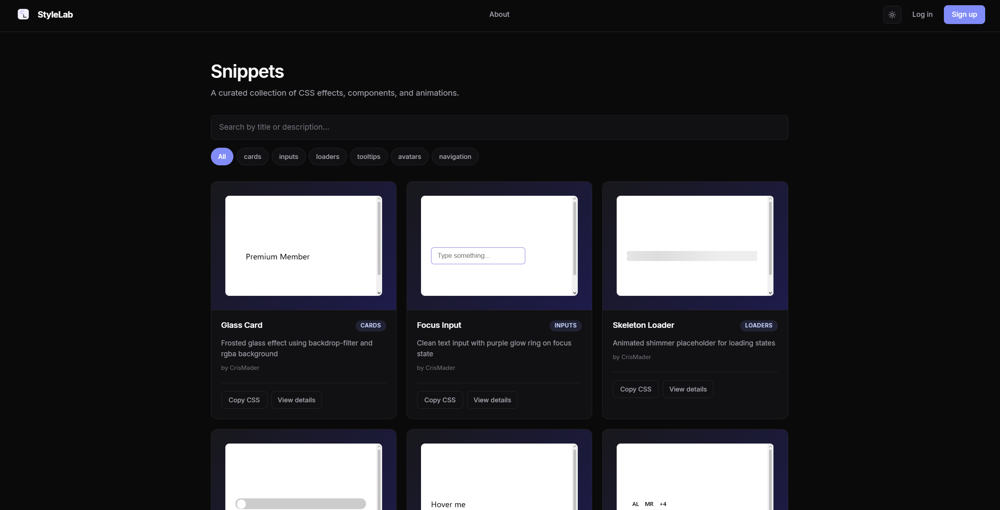
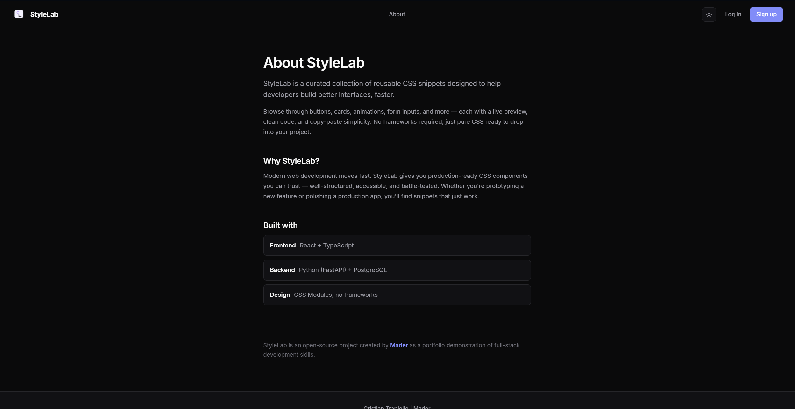
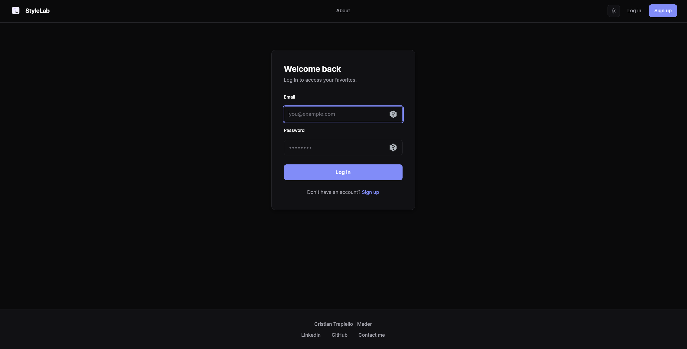
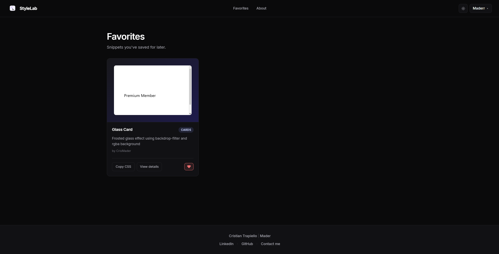
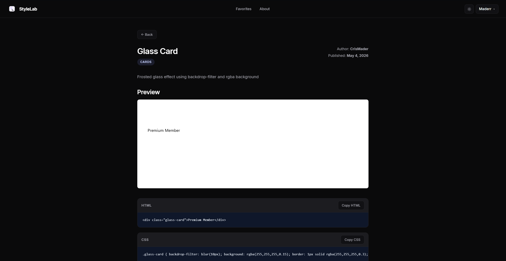

<div align="center">



# StyleLab

**A curated collection of reusable CSS snippets for modern web development.**

[](LICENSE)
[]()
[]()
[]()
[]()
[]()

</div>

---

## ✨ What is StyleLab?

**StyleLab** is an interactive gallery of **reusable CSS snippets** designed to help developers
build better interfaces, faster.

Browse through buttons, cards, animations, form inputs, and more — each with a **live preview**,
**clean code**, and **copy-paste simplicity**. No frameworks required, just pure CSS ready to drop
into your project.

> 💡 Whether you're prototyping a new feature or polishing a production app,
> you'll find snippets that just work.

---

## 📸 A quick tour

A walkthrough of the app's main views.

### 🏠 Home — Browse snippets

The main gallery. Browse the full collection of snippets with **live previews**, filter
by category, and search by title or description.

<p align="center">
  
</p>

---

### ℹ️ About — What & why

A dedicated page that explains **what StyleLab is**, the philosophy behind it, and the
tech stack used to build it.

<p align="center">
  
</p>

---

### 🔐 Login — User authentication

Clean, minimal sign-in screen. Authentication is JWT-based and unlocks personal features
like saving favorites.

<p align="center">
  
</p>

---

### ❤️ Favorites — Your personal collection

Every signed-in user gets a **personal Favorites page** where they can curate the
snippets they want to keep close at hand.

<p align="center">
  
</p>

---

### 🔍 Details — Full snippet view

Click **View details** on any snippet to open the full view: a **larger live preview**
plus both the **HTML and CSS code**, each with its own one-click copy button.

<p align="center">
  
</p>

---

## 🚀 Getting started

The project is split into two services: a **React + TypeScript** frontend and a
**FastAPI + PostgreSQL** backend.

### Prerequisites

- **Node.js** ≥ 18
- **Python** ≥ 3.12
- **PostgreSQL** running locally (database: `stylelab`)

### 1️⃣  Frontend

```bash
# Install dependencies
npm install

# Start the dev server
npm run dev
```

The app will be available at **http://localhost:5173**.

### 2️⃣  Backend

```bash
cd backend

# Create a virtual environment
python -m venv venv
venv\Scripts\activate          # Windows
# source venv/bin/activate     # macOS / Linux

# Install dependencies
pip install -r requirements.txt

# Start the API
uvicorn app.main:app --reload
```

The API will be available at **http://127.0.0.1:8000**.

> ⚠️  Make sure the `backend/.env` file contains your database URL and JWT secret
> before starting the API.

---

## 🛠️ Tech stack

<table>
  <tr>
    <td><strong>Frontend</strong></td>
    <td>React 19, TypeScript, Vite, React Router, CSS Modules</td>
  </tr>
  <tr>
    <td><strong>Backend</strong></td>
    <td>Python 3.12, FastAPI, SQLAlchemy, JWT auth</td>
  </tr>
  <tr>
    <td><strong>Database</strong></td>
    <td>PostgreSQL</td>
  </tr>
  <tr>
    <td><strong>Design</strong></td>
    <td>CSS Modules — no frameworks, no Tailwind</td>
  </tr>
</table>

---

## 🤖 Built with Claude Code

This project was developed with assistance from **[Claude Code](https://claude.com/claude-code)**,
Anthropic's AI coding agent, used to:

- ⚡ **Speed up** repetitive scaffolding and boilerplate
- 🔧 **Automate** parts of the redesign and refactoring process
- 🎨 **Iterate** quickly on UI/UX decisions

> 🧠 Claude Code is used as a *collaborator*, not a replacement —
> every decision is reviewed, adjusted, and validated by hand.

---

## 👤 Author

<table>
  <tr>
    <td>
      <strong>Cristian Trapiello&nbsp;|&nbsp;Mader</strong><br/>
      <a href="https://www.linkedin.com/in/cristian-trapiello">LinkedIn</a>
      &nbsp;·&nbsp;
      <a href="https://github.com/CrisMader">GitHub</a>
      &nbsp;·&nbsp;
      <a href="mailto:mader.projects@gmail.com">mader.projects@gmail.com</a>
    </td>
  </tr>
</table>

---

## 🚧 Project status

> **StyleLab is still in active development.**
> New features, snippets, and refinements are being added regularly. Feedback and ideas are
> welcome.

### Roadmap

- [ ] Snippet creation form (UI)
- [ ] Pagination & advanced filtering
- [ ] User profiles with public collections
- [ ] Tests (frontend + backend)
- [ ] Deployment

---

## 📄 License

This project is licensed under the **MIT License** — see the [LICENSE](LICENSE) file for details.

---

<div align="center">

Made with ☕ and a bit of indigo by **Mader**

</div>
